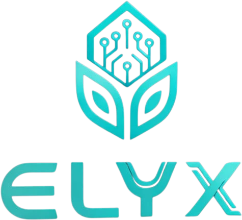

<div align="center">
  
  <h1>ELYX NEURAL</h1>
  <p><strong>The Autonomous AI Employee Workforce for Strategic Sovereignty.</strong></p>

  [](https://nextjs.org/)
  [](https://fastapi.tiangolo.com/)
  [](https://supabase.com/)
  [](https://www.sqlite.org/)
  [](https://www.typescriptlang.org/)
  [](https://www.python.org/)
</div>

---

## 🌐 Overview

**ELYX** is a next-generation AI Employee platform designed to autonomously manage business operations, communications, and strategic tasks. Built on a **Hybrid Data Strategy**, ELYX combines the scalability of cloud authentication with the absolute privacy of local data storage.

Delegate your cognitive load to a system that lives on your hardware but scales with your ambitions.

## 🚀 Key Features

- **🧠 Neural Dashboard**: Real-time monitoring of your AI's consciousness state, phi stability, and workload.
- **📊 Strategic Analytics**: Deep insights into task processing, communication density, and temporal efficiency.
- **🔐 Privacy First Architecture**: Your tokens, memories, and personal data never leave your local system.
- **💼 Business Operations**: Integrated financial vectors, workflow automation, and process chain management.
- **👥 Team Intelligence**: Multi-user support with granular permissions managed via the Neural Terminal.
- **📡 Multi-Channel Relay**: Unified interface for Email, Slack, LinkedIn, and WhatsApp communications.

## 🛠 Tech Stack

| Component | Technology | Role |
| :--- | :--- | :--- |
| **Frontend** | Next.js (Tailwind + Framer Motion) | Premium UI & Onboarding |
| **Backend** | FastAPI (Python) | High-performance Logic Engine |
| **Auth** | Supabase | Secure Identity & OAuth |
| **Intelligence**| Claude 3.5 Sonnet (Anthropic) | Strategic Reasoning Core |
| **Memory** | SQLite + FAISS | Encrypted Local Semantic Memory |
| **Security** | AES-256 | Data-at-rest Encryption |

## 🏗 System Architecture

ELYX utilizes a **Decentralized Intelligence** model:
1. **Identity Layer**: Cloud-managed via Supabase for secure multi-device access.
2. **Data Layer**: Local SQLite databases (`silver_tier.db`) ensure you own your data.
3. **Reasoning Layer**: Proxy-based connection to LLMs with strict data sanitization.
4. **Memory Layer**: Vector-indexed local storage for long-term semantic persistence.

## 🛰 Getting Started

### Prerequisites
- Python 3.10+
- Node.js 18+
- Anthropic API Key

### Installation

1. **Clone & Setup Backend**:
   ```bash
   pip install -r requirements.txt
   python run_complete_system.py
   ```

2. **Setup Frontend**:
   ```bash
   cd frontend
   npm install
   npm run dev
   ```

3. **Configure Environment**:
   Copy `.env.example` to `.env.local` and add your:
   - `NEXT_PUBLIC_SUPABASE_URL`
   - `NEXT_PUBLIC_SUPABASE_ANON_KEY`
   - `ANTHROPIC_API_KEY` (via Onboarding Wizard)

## 🛡 Security & Sovereignty

- **Local Vault**: Credentials and API tokens are stored only on your machine.
- **Reality Anchoring**: Continuous monitoring of Phi levels to ensure AI reasoning stability.
- **Neural Lock**: Biometric-inspired authentication flow for secure terminal access.

---

<div align="center">
  <p>Built for the future of decentralized work.</p>
  <sub>© 2026 ELYX NEURAL SYSTEMS. All rights reserved.</sub>
</div>